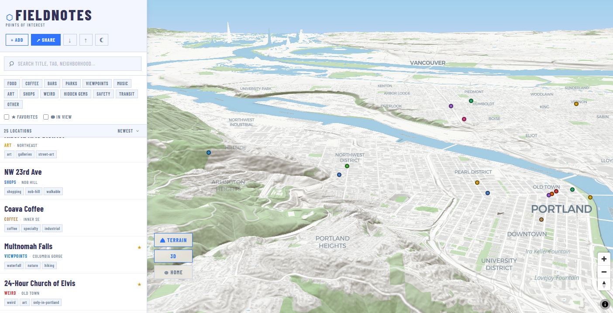

# FieldNotes

> Drop, tag, filter, and share points of interest — anywhere in the world.



A full-screen web app for mapping and sharing POIs. Dark by default, map-first, with a clean high-contrast aesthetic. Share any collection of points via a single URL.

## Stack

| Layer | Tech |
|---|---|
| Framework | React 19 + TypeScript |
| Build | Vite 8 |
| Map | MapLibre GL JS |
| Basemap | CartoDB Dark Matter / Positron (no API key needed) |
| State | Zustand (with localStorage persistence) |
| Backend | Supabase (optional — required for sharing) |
| Styles | Plain CSS + CSS custom properties |

## Quick Start

```bash
npm install
npm run dev
```

Open **http://localhost:5173** — the map opens centered on your current location (or Portland as fallback) with seed POIs pre-loaded.

## Sharing (Supabase Setup)

The **↗ SHARE** button saves your current POIs to Supabase and generates a shareable URL (`?c=<id>`). Anyone opening that link sees your map in read-only view.

### 1 — Create a Supabase project

1. Go to [supabase.com](https://supabase.com) and create a free account + new project
2. In the **SQL Editor**, run:

```sql
create table collections (
  id text primary key,
  title text,
  pois jsonb not null default '[]',
  created_at timestamptz default now(),
  updated_at timestamptz default now()
);

alter table collections enable row level security;
create policy "Public read"   on collections for select using (true);
create policy "Public insert" on collections for insert with check (true);
```

### 2 — Add your credentials

Copy `.env.example` to `.env` and fill in your project values from **Project Settings → API**:

```
VITE_SUPABASE_URL=https://your-project-id.supabase.co
VITE_SUPABASE_ANON_KEY=your-anon-key-here
```

### 3 — Restart the dev server

```bash
npm run dev
```

The ↗ SHARE button will now be active. Without credentials, the app runs fully offline using localStorage.

## Features

### Map
- **Full-screen MapLibre GL JS map** — smooth pan/zoom, no API key required
- **Dark / light mode** — toggle between CartoDB Dark Matter and Positron basemaps
- **Custom water color** — blue water in both themes
- **Custom green spaces** — parks, grass, and nature reserves rendered green
- **3D buildings** — toggle extruded buildings (zooms to street level, tilts camera)
- **Geolocation** — map opens at your current location; ⊕ HOME button returns there

### POIs
- **Add POI** — click "+ ADD", then click any point on the map to place it
- **Fields** — title, description, category, tags, area/neighborhood, photo URL, website URL
- **13 categories** — food, coffee, bars, parks, viewpoints, music, art, shops, weird, hidden gems, safety, transit, other
- **Detail drawer** — click any marker or list item for full details, links, and image
- **Edit & delete** — full CRUD on every POI
- **Favorites** — star/unstar from the detail view

### Panel & Filtering
- **Live list panel** — dense scrollable list of visible/filtered POIs
- **Search** — filter by title, tag, area, or category
- **Category filter chips** — toggle one or more categories
- **In View** — show only POIs currently visible on the map
- **Favorites only** — filter to starred POIs
- **Sort** — newest, alphabetical, category, area

### Sharing
- **↗ SHARE** — saves all current POIs to Supabase, updates the URL, shows a copyable link
- **Read-only view** — recipients see the shared map with all POIs; edit/delete are hidden
- **Open in Editor** — recipient can fork the shared map into their own local session
- **Export / Import** — download POIs as JSON, re-import from file (works offline)
- **localStorage persistence** — POIs survive page refresh without Supabase

## Project Structure

```
src/
  lib/            Supabase client + collections API
  types/          TypeScript interfaces + constants
  data/           Seed POIs
  store/          Zustand store (CRUD, filters, map state, collection loading)
  hooks/          useTheme (dark/light mode, OS preference detection)
  utils/          Filter/sort logic, geo constants
  components/
    MapView/      MapLibre GL JS wrapper (map, markers, 3D, water/green colors)
    Panel/        SidePanel, POIListItem, FilterBar
    Detail/       DetailDrawer
    Forms/        Add/Edit modal
    UI/           SearchBar, ShareButton
```

## Environment Variables

| Variable | Required | Description |
|---|---|---|
| `VITE_SUPABASE_URL` | For sharing | Your Supabase project URL |
| `VITE_SUPABASE_ANON_KEY` | For sharing | Your Supabase anon/public key |

The app runs fully without these — sharing is simply disabled until they are set.

